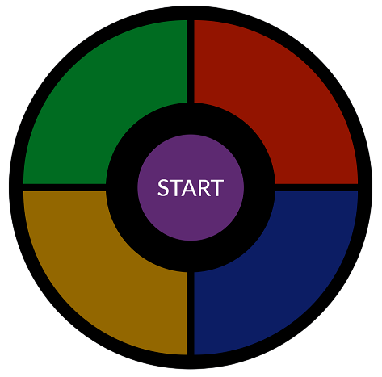

# Simon Game - Get ready to watch, remember, repeat!

<p align="center">

</p>
<p align="center">


<br/>


</p>

<br />

## Languages and Tools used


<br />

## Description

The Simon game is the exciting electronic game of lights and sounds in which players must repeat random sequences of lights by pressing the colored pads in the correct order. It's fast-paced play, with lights and sounds that can challenge you. Experience the fun as you repeat the patterns and advance to higher levels. Keep track of your score as you challenge friends or try to beat your own high score.

<br />

## Getting Started

- Clone the repository to your local machine (or server).
  ```bash
  $ git clone https://github.com/Revature-Mini-Project/Please_Dont_Fire_Us.git path/to/dir
  $ cd path/to/dir
  ```
- Install necessary packages.
  ```bash
  npm install
  ```
- Run code for testing.
  ```bash
  npm start
  ```
- Visit http://localhost:3000/ to play!
- To deploy, see: https://facebook.github.io/create-react-app/docs/deployment

<br />

<p align="center">

</p>

## To Play the Game

- Press start and watch the pattern.
- Repeat the pattern in the same order by clicking each color.
